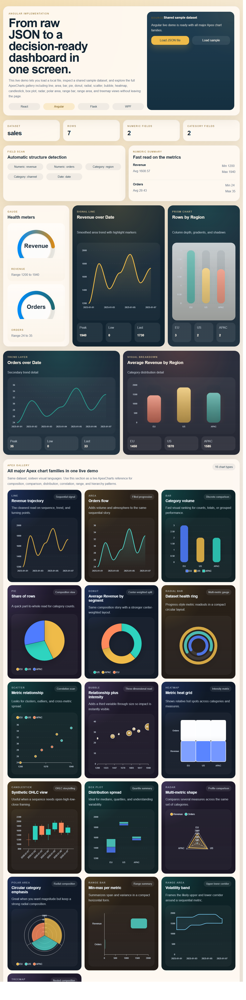
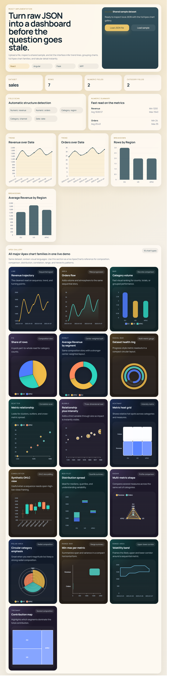

# jsondash

[](LICENSE)
[](https://github.com/aykutsp/jsondash/commits/main)
[](https://www.microsoft.com/windows)
[](react)
[](angular)
[](flask)
[](wpf)
[](https://apexcharts.com/)

`jsondash` is a multi-stack analytics application that turns raw JSON into a structured dashboard. Its goal is simple: make JSON-based reporting easier to inspect, easier to share, and easier to ship across different platforms without changing the product idea.

The same application is implemented in four stacks: React + TypeScript, Angular + TypeScript, Flask + Python/HTML/CSS/JavaScript, and WPF + C#/XAML. Each implementation can load local JSON files, infer schema automatically, generate KPI cards and summaries, render quick charts, display a full ApexCharts gallery, and keep source rows searchable in one screen.

## Contents

- [Preview](#preview)
- [Why jsondash](#why-jsondash)
- [Technology stack](#technology-stack)
- [Features](#features)
- [Quick start](#quick-start)
- [Run each stack manually](#run-each-stack-manually)
- [How to use the app](#how-to-use-the-app)
- [Example JSON](#example-json)
- [Example code](#example-code)
- [JSON shape expectations](#json-shape-expectations)
- [Project structure](#project-structure)
- [Architecture notes](#architecture-notes)
- [Verification](#verification)
- [License](#license)

## Preview

The screenshots below were captured in Chrome from local application runs using the shared sample dataset.





## Why jsondash

- Provide a single analytics product that works across web, server-rendered, and desktop environments.
- Turn unfamiliar JSON into a readable operational dashboard in minutes.
- Offer a practical starting point for internal reporting tools, analytics surfaces, and dashboard-driven products.
- Make stack comparison easier when teams need to choose between React, Angular, Flask, or WPF.

## Technology Stack

| Stack | Language(s) | Rendering model | Charting approach | Start command |
| --- | --- | --- | --- | --- |
| React | TypeScript | Client-side SPA | `react-apexcharts` | `.\launch.ps1 -Stack React` |
| Angular | TypeScript | Client-side SPA | `ng-apexcharts` + `apexcharts` | `.\launch.ps1 -Stack Angular` |
| Flask | Python, HTML, CSS, JavaScript | Server-rendered web app | ApexCharts in the browser | `.\launch.ps1 -Stack Flask` |
| WPF | C#, XAML | Native Windows desktop app | Embedded Apex gallery via WebView2 | `.\launch.ps1 -Stack WPF` |

## Features

- Load local JSON files directly from the UI.
- Restore the shared `sales.json` sample in one click.
- Detect numeric, categorical, and date-like fields automatically.
- Show KPI cards for dataset shape.
- Generate numeric summaries with averages, minimums, and maximums.
- Render trend and breakdown panels from inferred fields.
- Render a complete ApexCharts gallery with line, area, bar, pie, donut, radial bar, scatter, bubble, heatmap, candlestick, box plot, radar, polar area, range bar, range area, and treemap views.
- Search and inspect raw rows without leaving the page or window.

## Quick Start

Use the launcher to choose a stack interactively:

```powershell
.\launch.ps1
```

Or start a specific implementation directly:

```powershell
.\launch.ps1 -Stack React
.\launch.ps1 -Stack Angular
.\launch.ps1 -Stack Flask
.\launch.ps1 -Stack WPF
```

## Requirements

### Common

- Windows PowerShell
- Access to the project folder

### React and Angular

- Node.js 20+ recommended
- npm

### Flask

- Python 3.11+ recommended
- `python` available on PATH

### WPF

- .NET SDK with Windows desktop support
- Windows environment
- WebView2 runtime available on the machine for the embedded Apex gallery

## Run Each Stack Manually

### React

```powershell
cd .\react
npm install
npm run dev -- --host 0.0.0.0
```

Default local URL:

```text
http://localhost:5173
```

### Angular

```powershell
cd .\angular
npm install
npm run live-demo
```

Default local URL:

```text
http://localhost:4200
```

### Flask

```powershell
cd .\flask
python -m venv .venv
.\.venv\Scripts\python.exe -m pip install --upgrade pip
.\.venv\Scripts\python.exe -m pip install -r requirements.txt
.\.venv\Scripts\python.exe app.py
```

Default local URL:

```text
http://127.0.0.1:5000
```

### WPF

```powershell
cd .\wpf
dotnet build
dotnet run
```

## How To Use The App

1. Launch the stack you want to explore.
2. Click `Load sample` to open the shared sales dataset instantly.
3. Click `Load JSON file` or `Open JSON file` to load your own file.
4. Review the KPI cards to confirm row and field counts.
5. Check the detected field tags to see how the parser classified your data.
6. Read the numeric summary to understand averages, minimums, and maximums.
7. Use the quick charts for a fast first pass.
8. Scroll to the Apex gallery to explore the same data through multiple chart families.
9. Use the search box in the data explorer to inspect matching rows.

## Example JSON

Use a structure like this when you want the automatic schema detection and chart generation to work well.

The repository already includes a ready-to-load sample at `shared/sample-data/sales.json`.

```json
{
  "sales": [
    {
      "date": "2025-01-01",
      "region": "EU",
      "channel": "Direct",
      "revenue": 1200,
      "orders": 24,
      "margin": 312
    },
    {
      "date": "2025-01-02",
      "region": "US",
      "channel": "Partner",
      "revenue": 1800,
      "orders": 31,
      "margin": 455
    },
    {
      "date": "2025-01-03",
      "region": "APAC",
      "channel": "Direct",
      "revenue": 1660,
      "orders": 29,
      "margin": 401
    }
  ]
}
```

Top-level arrays also work:

```json
[
  { "date": "2025-01-01", "region": "EU", "revenue": 1200, "orders": 24 },
  { "date": "2025-01-02", "region": "US", "revenue": 1800, "orders": 31 },
  { "date": "2025-01-03", "region": "APAC", "revenue": 1660, "orders": 29 }
]
```

## Example Code

### Launch a specific stack

```powershell
.\launch.ps1 -Stack Angular
```

### Fetch analyzed data from the Flask API

```bash
curl http://127.0.0.1:5000/api/dashboard
```

### Load a local file in React

```tsx
async function handleFile(file: File) {
  const raw = await file.text();
  const parsed = JSON.parse(raw);
  setDashboard(analyzeJson(parsed));
}
```

### Create an Apex chart config from analyzed metrics

```ts
const options = {
  chart: { type: "line", height: 280 },
  series: [
    {
      name: "Revenue",
      data: [1200, 1800, 1660, 1940]
    }
  ],
  xaxis: {
    categories: ["2025-01-01", "2025-01-02", "2025-01-03", "2025-01-04"]
  }
};
```

### Start the Flask app with the local virtual environment

```powershell
cd .\flask
.\.venv\Scripts\python.exe app.py
```

## JSON Shape Expectations

The parser is flexible, but the smoothest path is:

- A top-level array of objects.
- Or a top-level object containing one array of objects.
- Numeric fields for metrics and chart values.
- Category or date-like fields for grouping and trend views.

Examples that work well:

```json
[
  { "date": "2025-01-01", "region": "EU", "revenue": 1200, "orders": 24 },
  { "date": "2025-01-02", "region": "US", "revenue": 1800, "orders": 31 }
]
```

```json
{
  "sales": [
    { "date": "2025-01-01", "region": "EU", "revenue": 1200, "orders": 24 },
    { "date": "2025-01-02", "region": "US", "revenue": 1800, "orders": 31 }
  ]
}
```

## Shared Data

The repository includes a shared sample dataset used by every implementation:

```text
shared/sample-data/sales.json
```

## Project Structure

```text
jsondash/
├── angular/
│   ├── src/
│   └── angular.json
├── docs/
│   └── assets/
├── flask/
│   ├── static/
│   ├── templates/
│   └── app.py
├── react/
│   ├── src/
│   └── package.json
├── shared/
│   └── sample-data/
├── wpf/
│   ├── Models/
│   ├── Services/
│   ├── ViewModels/
│   └── MainWindow.xaml
├── .gitignore
├── launch.ps1
├── LICENSE
└── README.md
```

## Architecture Notes

### Shared analysis flow

Every stack follows the same product logic:

- Find the active dataset.
- Inspect the available keys.
- Infer which keys are numeric, categorical, and date-like.
- Build summary metrics.
- Create lightweight trend and breakdown charts.
- Feed a larger chart gallery from the inferred structure.

### Shared UI shape

Every implementation is organized around the same flow:

- Hero and source selection
- KPI row
- Field scan and numeric summary
- Quick charts
- Full Apex gallery
- Searchable row explorer

### Why four stacks

This repository is useful when you need to:

- Compare frontend and desktop delivery approaches.
- Run the same product in different environments.
- Benchmark how fast a concept can move across frameworks.
- Choose the implementation style that best fits a team or deployment target.

## Verification

Verified locally during setup:

- Angular: `npm run build`
- React: `npm run build`
- Flask: test client request returns `200`
- WPF: `dotnet build`

## Publishing Notes

- `node_modules`, virtual environments, build output, logs, and editor-only folders are excluded through `.gitignore`.
- The repository is intended to publish only source, shared data, launcher scripts, assets, and public documentation.

## License

License
MIT. See LICENSE.

Feel free to use this project however you like - fork it, ship it, tear it apart, build something bigger on top of it. If you end up using it in something public, a small credit or a link back would make my day, but it's not a requirement. Thanks for taking a look.
